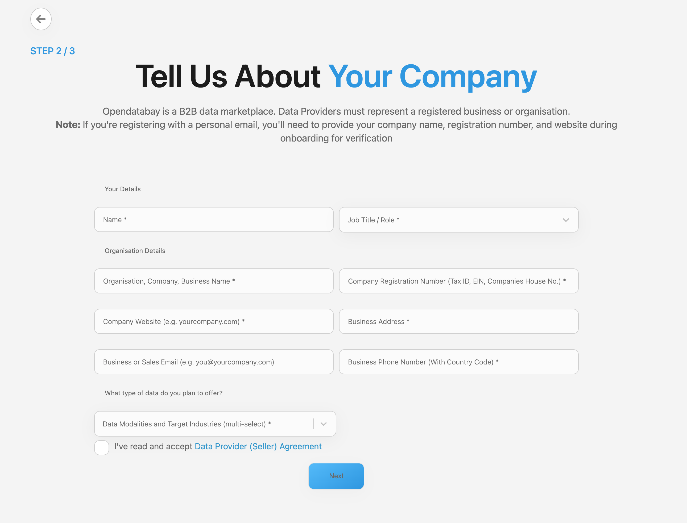

# Data Provider Onboarding

Become a verified data provider on Opendatabay and start listing your datasets. The process takes 15-20 minutes to complete, with 1-2 business days for verification.

## Onboarding Steps

### 1. Create Your Account

**Register at** [**Opendatabay**](https://www.opendatabay.com)

**Recommended:** Use your **company domain email** (e.g., name@yourcompany.com)

While Google and GitHub login options are available, company email ensures faster verification and establishes business credibility.


<figure><figcaption></figcaption></figure>

***

### 2. Complete 3-Step Verification

After registration, you'll complete a self-onboarding process:

#### Step 1: Choose Your Role

Select **"Data Provider (Seller)"**

<figure><figcaption></figcaption></figure>

#### Step 2: Business Information

Provide:

* Your role at the company
* Company name and registration number
* Company registered address
* Website URL and social media handles
* Business entity type
* Phone number and sales email

**Important:** We currently only accept **registered businesses** (Ltd, LLC, GmbH, etc.). Individual sellers and self-employed providers cannot list data products.

<figure><figcaption></figcaption></figure>

#### Step 3: Business Description

Provide:

* About Your Company - This description will be public on your profile

```javascript
                  'e.g. "We are a specialist automotive photography studio with 30 years of experience, working with major OEMs and insurers across Europe. \n \nNamed the leading studio by Auto Imagery Magazine (2023), featured in Forbes, and with an active YouTube channel showcasing our work at youtube.com/ourstudio. Our clients include BMW, Allianz, and LV= Insurance. \n \nWe own 100% of all imagery and hold signed model releases for all subjects. Full data provenance documentation is available on request."'
```

* Explain your data offering - This description will be used to verify your business

<pre class="language-javascript"><code class="lang-javascript"><strong>'e.g. "We plan to list 3 data products under commercial AI training license, no third party rights apply.  \n \n20K high-res vehicle part images, object-labelled, ideal for computer vision and defect detection models. 10K high-res images of damaged vehicles, numberplates anonymised, suitable for insurance damage assessment and repair estimation models. 50K close-up paint and body panel images labelled by defect type (scratch, dent, corrosion), ideal for damage severity grading models.
</strong></code></pre>

* How did you hear about us ?

<figure><figcaption></figcaption></figure>

***

### 3. Complete Your Profile

After onboarding, you'll access your public profile page (not yet visible to others).

<figure><figcaption></figcaption></figure>

**Add:**

* Company logo and banner image
* Extended company description
* Additional business details

<figure><figcaption></figcaption></figure>

**Click "Verify My Account"** to submit for review.


<figure><figcaption></figcaption></figure>

***

### 4. Opendatabay Verification

**What we verify:**

* Company registration validity
* Website and social media presence
* Contact information accuracy (phone number, sales email)
* Data product suitability
* Compliance with platform policies

**Timeline:** 1-2 business days

***

### 5. Start Listing Data

Once approved, you'll receive an email confirmation, your profile becomes publicly visible, and you can start listing your data products.
