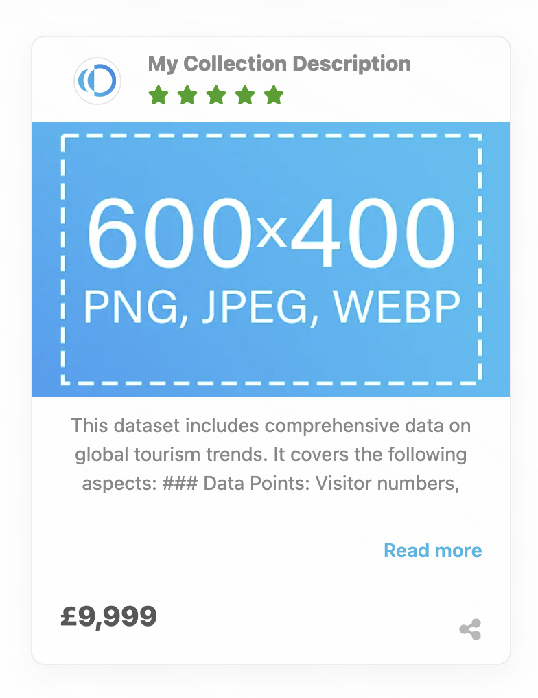

# How Opendatabay Works

Opendatabay is the **AI Training Data Exchange** connecting data providers with AI developers, reducing data acquisition from weeks to seconds.

## The Purpose

**We solve the AI data supply problem.**

AI developers waste 40-60% of project time sourcing, cleaning, and licensing training data. The end of free scraping has created a data crisis, while existing solutions require weeks of manual negotiation.

Opendatabay makes AI-ready datasets instantly discoverable, legally compliant, and immediately usable.

<figure><figcaption></figcaption></figure>

***

## How It Works

### For Data Buyers (AI Developers, LLM teams, Enterprise buyers)

**1. Discover**

* Search on the platform or ask any LLM (ChatGPT, Claude, Perplexity, etc.)
* All datasets are automatically exposed to major LLMs and search engines
* Get AI-powered recommendations with accuracy scores

**2. Evaluate**

* Review quality scores, provenance, and use cases
* Check licensing terms (General or Commercial AI License)
* Compare pricing and delivery methods

**3. Purchase & Access**

* Instant download or API access
* AI-ready formats (CSV, JSON, Parquet)
* Clear licensing for training, fine-tuning, commercial use

**4. Train Models**

* Pre-processed datasets save 20-40% preprocessing time
* Ready for immediate model training
* No legal risk from unlicensed data

***

### For Data Providers (Sellers)

**1. List Dataset**

* Upload data and add its description
* Set pricing and license type
* Platform verifies and processes

**2. Automatic Exposure**

* Instantly discoverable by all major LLMs
* Indexed by search engines
* Featured in platform search results

**3. Get Paid**

* Tiered commission: 5-30% based on sale price
* Payments within 30 days
* Transparent transaction records

***

## Where Opendatabay Stands

**Opendatabay is the marketplace infrastructure in the middle:**

Data Providers (Sellers) → Opendatabay (Marketplace) → AI Developers (Buyers)

## What Makes Us Different

* **AI-First**: 100% focused on AI training data, not general data
* **Instant Access**: No weeks of negotiation, purchase and download in seconds
* **LLM Discovery**: First marketplace with automatic LLM exposure
* **Legal Certainty**: Standardised AI licenses eliminate risk

***

## Who Benefits

| Role               | Benefit                                          |
| ------------------ | ------------------------------------------------ |
| **AI Startups**    | Fast access to training data without legal teams |
| **Researchers**    | Affordable datasets for academic projects        |
| **Enterprises**    | Compliant data for production AI systems         |
| **Data Owners**    | Monetise datasets with global reach              |
| **LLM Developers** | Domain-specific fine-tuning data instantly       |

***

## Our Mission

Our mission is to serve both humans and machines with the highest-quality AI training data, while enabling data providers to securely monetise their work.

We're building the infrastructure layer for responsible AI development, making AI data discovery and access as seamless as shopping on Amazon.
